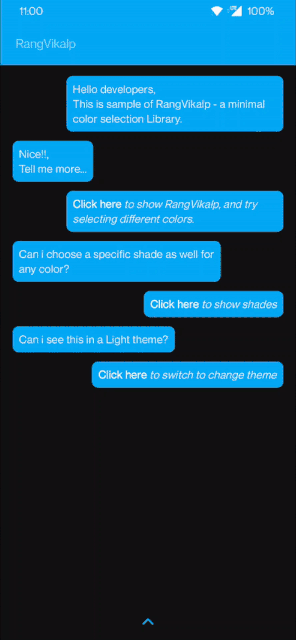
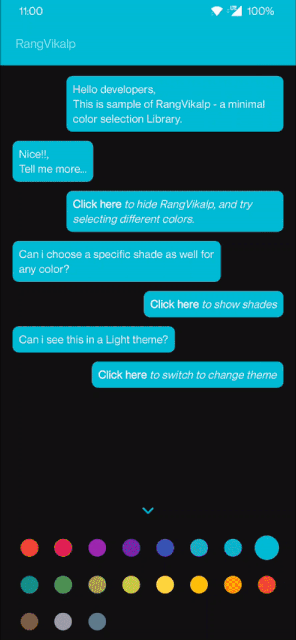
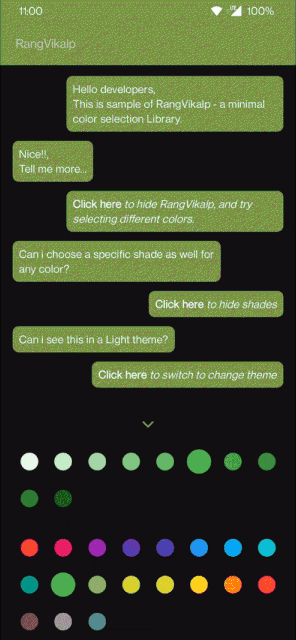

# RangVikalp
Minimal Color Picker in Jetpack Compose

[](https://search.maven.org/artifact/io.ak1/rang-vikalp)

## Demo
    


## Usage
 ```kotlin
 var isVisible by remember { mutableStateOf(true) }
 
 RangVikalp(isVisible) {
 // returns selected color
 }
 ```
 
With multiple parameters to customise vast color selection 

```kotlin
@Composable
fun RangVikalp(
    isVisible: Boolean,              // change visbility 
    rowElementsCount: Int,           // number of color selections per row 
    showShades: Boolean,             // show shades of selected color
    colorIntensity: Int,             // change the intensity of color selection (0..9)
    unSelectedSize: Dp,              // customise default size of color options
    selectedSize: Dp,                // customise size of selected color
    colors: List<List<Color>>,       // manually add custom colors to show in selector
    defaultColor: Color,             // add default selected color 
    clickedColor: (Color) -> Unit    // gives selected color
)   
```

## Download
[](https://search.maven.org/artifact/io.ak1/rang-vikalp) or grab via Gradle:
 
include in app level build.gradle
 ```groovy
 repositories {
    mavenCentral()
 }
 ```
```groovy
 implementation  'io.ak1:rang-vikalp:1.0.0-alpha02'
```
or Maven:
```xml
<dependency>
  <groupId>io.ak1</groupId>
  <artifactId>rang-vikalp</artifactId>
  <version>1.0.0-alpha02</version>
  <type>pom</type>
</dependency>
```
or ivy:
```xml
<dependency org='io.ak1' name='rang-vikalp' rev='1.0.0-alpha02'>
  <artifact name='rang-vikalp' ext='pom' ></artifact>
</dependency>
```

## Thanks to
[DrawBox](https://github.com/akshay2211/DrawBox) for using RangVikalp as it's color picker library

## License
Licensed under the Apache License, Version 2.0, [click here for the full license](/LICENSE).

## Author & support
This project was created by [Akshay Sharma](https://akshay2211.github.io/).

> If you appreciate my work, consider buying me a cup of :coffee: to keep me recharged :metal: by [PayPal](https://www.paypal.me/akshay2211)

> I love using my work and I'm available for contract work. Freelancing helps to maintain and keep [my open source projects](https://github.com/akshay2211/) up to date!
