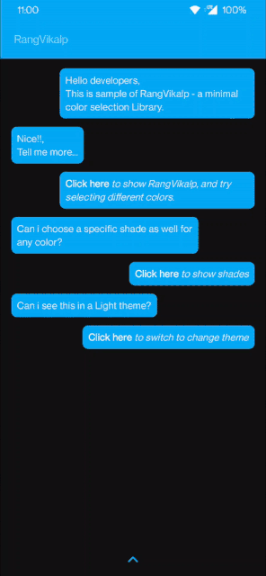
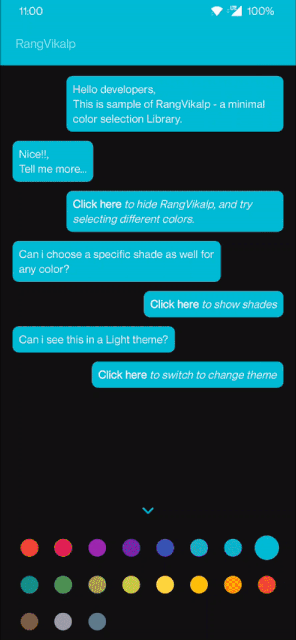
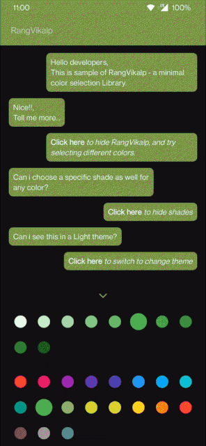

# RangVikalp

[](https://search.maven.org/artifact/io.ak1/rang-vikalp)
[](https://kotlinlang.org)
[](https://kotlinlang.org/lp/multiplatform/)
[](https://www.jetbrains.com/lp/compose-multiplatform/)
[](LICENSE)

> A modern, fully composable HSV colour picker for **Compose Multiplatform** — drop in the whole picker or just the pieces you need.

`RangVikalp` ships a complete, design-tool-style colour picker built entirely with `Brush` + `Canvas` so it has zero external drawable resources, zero platform-specific code in the common surface, and a hoisted state model that makes every piece composable on its own.

## Supported Targets

[](#)
[](#)
[](#)
[](#)
[](#)

`androidTarget`, `iosArm64`, `iosSimulatorArm64`, `jvm()`, `js(IR)`, `wasmJs` — all from a single shared codebase.

## Demo

    

## Install

```kotlin
// build.gradle.kts
repositories { mavenCentral() }

dependencies {
    implementation("io.ak1:rang-vikalp:1.0.0-beta1")
}
```

For a KMP project, add it to `commonMain`:

```kotlin
kotlin {
    sourceSets {
        commonMain.dependencies {
            implementation("io.ak1:rang-vikalp:1.0.0-beta1")
        }
    }
}
```

## Quick start

```kotlin
@Composable
fun MyScreen() {
    val state = rememberRangVikalpState(initial = Color(0xFF2196F3))

    RangVikalp(
        state = state,
        onColorChange = { picked ->
            // every drag / tap / preset selection lands here
        },
    )
}
```

That's it. You get the full tabbed picker (Preset + Custom) themed for the current dark/light mode automatically.

## Public components

Every internal piece is its own public composable, so you can build any layout — full picker, a single SV box, an arc-only ring picker, presets-with-shades, whatever the screen needs.

### State

| Composable / Class | What it does |
|---|---|
| `rememberRangVikalpState(initial)` | The single source of truth — HSV-A floats with derived `color`, `hex6`, `opacityPercent` |
| `RangVikalpState.setFromColor(c)` | Push a colour in from outside (preset tap, eyedropper, theme change) |

### Theming

| Composable / Class | What it does |
|---|---|
| `RangVikalpColors` | Surface, surfaceInset, border, onSurface, onSurfaceMuted, accent |
| `defaultRangVikalpColors(dark)` | Tuned defaults — deep-violet dark and near-white light |
| `defaultRangVikalpPresets` | 9 quick-pick swatches sourced from the bundled Material palette |
| `colorArray` | 19 colour families × 10 shades — the full Material palette for `PresetSwatches` |

### Top-level picker

| Composable | What it does |
|---|---|
| `RangVikalp(state, presets, presetGroups, colors, initialTab, showTabs, onColorChange)` | Full tabbed picker — Preset (swatch grid + shade row) and Custom (SV box + sliders) tabs share the same min-height so the card doesn't resize between tabs |

### Pickers (SV)

| Composable | What it does |
|---|---|
| `SaturationValueBox(state, modifier, cornerRadius, thumbRadius)` | Rounded-rect SV plane. Touch math covers the full 0..1 SV range; thumb is clamped inside the curved corners |
| `SaturationValueCircle(state, modifier, thumbRadius)` | Disk-shaped SV picker. Pointer presses outside the disk project onto the boundary so saturation/value never point somewhere invisible |

### Sliders — linear

| Composable | What it does |
|---|---|
| `HueSlider(state, modifier, trackHeight, thumbRadius)` | Rainbow pill, tap + drag, writes `state.hue` |
| `AlphaSlider(state, modifier, trackHeight, thumbRadius, checkerLight, checkerDark)` | Checkerboard pill with transparent→opaque hue overlay, writes `state.alpha` |

### Sliders — arc / ring

| Composable | What it does |
|---|---|
| `ArcHueSlider(state, modifier, rotationDeg, sweepDeg, trackThickness, thumbRadius, segmentCount)` | Arc-shaped hue picker. Defaults to a full ring; `sweepDeg < 360` for half-rings / partial arcs with dead-zone snapping |
| `ArcAlphaSlider(state, modifier, rotationDeg, sweepDeg, trackThickness, thumbRadius, transparentBacking, segmentCount)` | Matching alpha arc with a configurable backing colour so the transparent end reads on any surface |

### Chips & rows

| Composable | What it does |
|---|---|
| `HexRow(state, modifier, colors, height, onCopy)` | Format chip · hex value with copy · opacity % — taps anywhere on the hex tile to copy `#RRGGBB` to the clipboard |
| `FormatChip` / `HexValueChip` / `OpacityChip` | The individual chips so you can lay out the row differently |
| `PresetsRow(state, presets, modifier, colors, swatchSize, onShuffle)` | Shuffle button + preset swatches. Shuffle skips the current colour by default |
| `PresetSwatches(state, families, modifier, colors, columnsPerRow, representativeIndex, familySwatchSize, shadeSwatchSize)` | Grid of family swatches; tapping one expands a row of its shades. Driven by `colorArray` by default |
| `PresetSwatch(color, selected, size, onClick)` / `ShuffleButton(colors, ..., onClick)` | Individual pieces |

### Tabs

| Composable | What it does |
|---|---|
| `TabStrip(tabs, selectedIndex, colors, modifier, height, onSelect)` | Animated pill tab strip. Used internally by `RangVikalp` and re-usable for any 2+ option toggle |

## Compose layouts you can drop in

**Compact picker** — square SV + sliders + hex:

```kotlin
Column(verticalArrangement = Arrangement.spacedBy(10.dp)) {
    SaturationValueBox(state, Modifier.fillMaxWidth().aspectRatio(1f))
    HueSlider(state)
    AlphaSlider(state)
    HexRow(state)
}
```

**Circular HSV** — three concentric rings:

```kotlin
Box(Modifier.size(280.dp), contentAlignment = Alignment.Center) {
    ArcHueSlider(state, Modifier.fillMaxSize())
    ArcAlphaSlider(state, Modifier.fillMaxSize(0.78f))
    SaturationValueCircle(state, Modifier.fillMaxSize(0.56f))
}
```

**Presets only** — Material palette + shade expansion:

```kotlin
PresetSwatches(state, families = colorArray)
```

**Quick pick** — one-line palette:

```kotlin
PresetsRow(state, presets = defaultRangVikalpPresets)
```

## Theming

```kotlin
RangVikalp(
    state = state,
    colors = defaultRangVikalpColors(dark = isSystemInDarkTheme()),
)

// Or fully custom
val brand = RangVikalpColors(
    surface        = Color(0xFF1A1A22),
    surfaceInset   = Color(0xFF252532),
    border         = Color(0xFF333344),
    onSurface      = Color(0xFFEDEDF5),
    onSurfaceMuted = Color(0xFF8E8AB8),
    accent         = Color(0xFF7B5BFF),
)
```

## Samples

The `:shared` module ships a multi-variation showcase with a menu screen + per-variation detail pages: tabbed picker, square + linear, circular stack, presets-only, quick-pick row, sliders-only. All variations share one `RangVikalpState`, so dragging in one updates every other live.

| Module | Run with |
|---|---|
| `:androidApp` | `./gradlew :androidApp:installDebug` |
| `:desktopApp` | `./gradlew :desktopApp:run` |
| `:webApp` | `./gradlew :webApp:wasmJsBrowserDevelopmentRun` |
| `:iosApp` | Open `iosApp/iosApp.xcodeproj` in Xcode |

## Thanks to
[DrawBox](https://github.com/akshay2211/DrawBox) for using RangVikalp as its colour picker library.

## License
Licensed under the Apache License, Version 2.0 — [full license](LICENSE).

## Author & support
Created by [Akshay Sharma](https://akshay2211.github.io/).

> If you appreciate my work, consider buying me a cup of :coffee: via [PayPal](https://www.paypal.me/akshay2211) — I'm available for contract work, and freelancing helps keep [my open source projects](https://github.com/akshay2211/) maintained.

---

<sub>**Tags / topics:** `kotlin-multiplatform` `compose-multiplatform` `color-picker` `colour-picker` `hsv` `jetpack-compose` `android` `ios` `desktop` `wasm` `material-design` `kmp` `kmm` `swatches` `palette`</sub>
